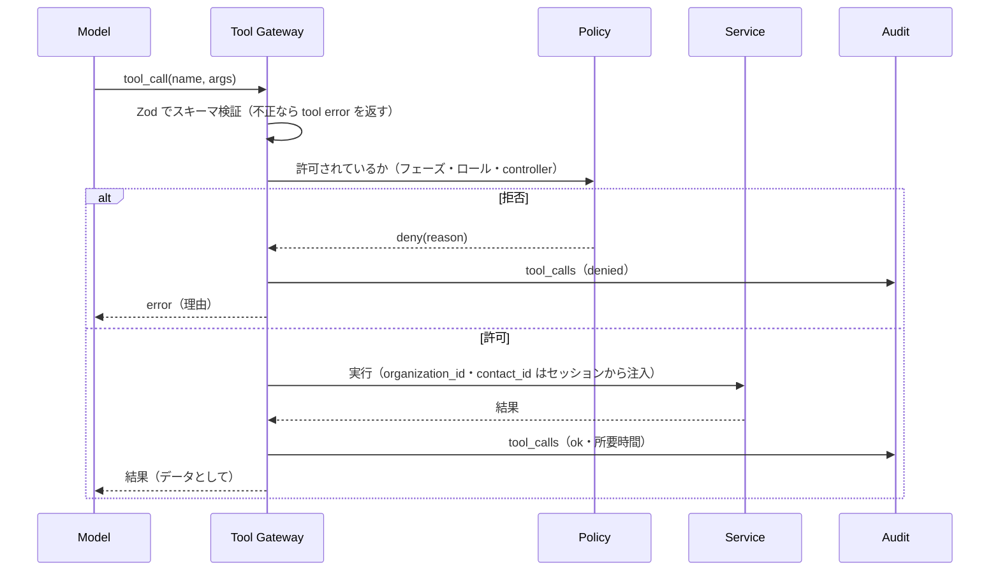
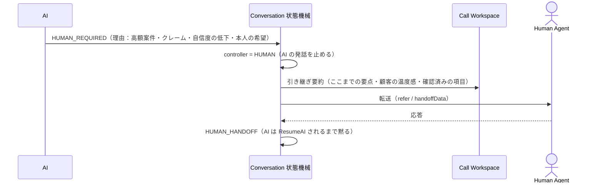
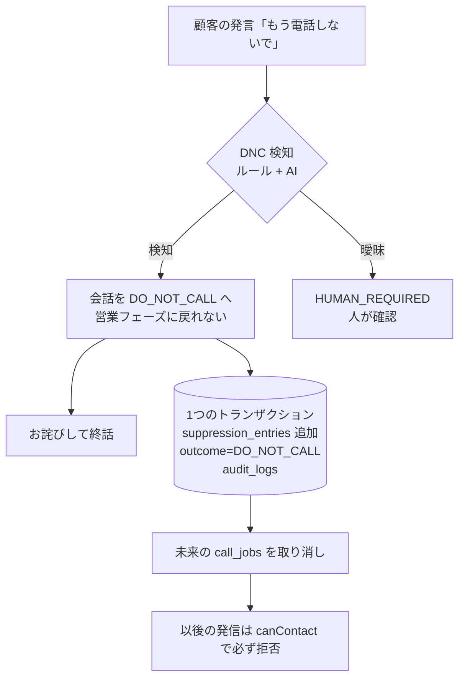

# AI_AGENT — AI エージェント設計

区分：すべて **PROPOSED**。

### プロンプトの層（1つの巨大な system prompt にしない）

| 層 | 内容 | 変更する人 | バージョン |
|---|---|---|---|
| Global Safety Policy | 拒否の尊重・虚偽の禁止・AI であることの開示・緊急時の対応 | 開発（コード） | `safety@x.y` |
| Organization Policy | 会社名・営業時間・言ってはいけないこと | Admin | 組織設定の版 |
| Campaign Policy | 商材・目的・ヒアリング項目 | Manager | キャンペーンの版 |
| Agent Persona | 「さくら」の話し方（現行 #124〜#126 の調整を引き継ぐ） | Admin | persona の版 |
| Conversation State | 今のフェーズと、このフェーズで許される行動 | 状態機械が生成 | — |
| Tool Policy | このフェーズで使えるツール | コード | — |
| Dynamic Context | 顧客情報・ナレッジの検索結果（**信頼しないデータとして区切って渡す**） | 実行時 | — |

通話ごとに `prompt_version / model_version / policy_version` を `calls` に保存する。

### ツール（最小権限）

| ツール | 種別 | 制約 |
|---|---|---|
| `get_contact` ・ `get_company` ・ `search_knowledge` ・ `get_availability` | 読み取り | 通話中の相手のデータに限る（ID はサーバー側で固定し、モデルには選ばせない） |
| `create_follow_up` | 書き込み | 日時の妥当性を検査。重複作成は冪等キーで防ぐ |
| `request_handoff` | 書き込み | いつでも使える |
| `mark_do_not_call` | 書き込み | 呼ばれたら必ず成功させる（取り消しは人だけ）。実行後は会話を終える |
| `book_appointment` | 書き込み | 担当者の承認（Human confirmation）を経てから確定する |

### 人への引き継ぎ（Human Handoff）

### 抑止（DNC）のフロー

DNC の検知は**ルール（キーワード）を先に、AI の判定を後に**評価し、どちらかが検知したら抑止する（取りこぼしを避ける側に倒す）。

## AI と人の役割分担

| AI が担当する | 人が担当する |
|---|---|
| 一次会話（名乗り・用件の説明） | 重要な商談・契約の判断 |
| ヒアリング・Qualification（電話5問） | 例外処理 |
| FAQ（ナレッジにある内容だけ） | クレーム（`COMPLAINT` で人へ） |
| 要約・CRM 入力の補助 | センシティブな相談 |
| 日程候補の提示（確定は人の承認後） | 高額案件・AI の自信度が下がったとき（`HUMAN_REQUIRED`） |

人が引き継いだら（Take Over）、AI は人が明示的に戻すまで話さない。これはドメインの状態機械で強制する（`conversation.ts` の `canAiSpeak`）。

## ツールの一覧（依頼文の9種）

| ツール | 種別 | 認可・検証 |
|---|---|---|
| `get_contact` | 読み取り | 通話中の相手だけ。ID はサーバーがセッションから注入 |
| `get_company` | 読み取り | 同上 |
| `search_knowledge` | 読み取り | 結果は信頼しないデータとして区切って渡す |
| `check_availability` | 読み取り | 担当者の空き時間だけを返す（他人の予定の中身は返さない） |
| `create_appointment` | 書き込み | 人の承認を経てから確定。重複は冪等キーで防ぐ |
| `create_followup` | 書き込み | 日時の妥当性（未来・時間帯）を検査 |
| `request_handoff` | 書き込み | いつでも使える |
| `mark_do_not_call` | 書き込み | 呼ばれたら必ず成功させる。取り消しは人（Admin）だけ |
| `record_outcome` | 書き込み | 分類コードだけを受け付ける。抑止を外す結果は AI からは記録できない |

すべてのツール呼び出しで、Zod によるスキーマ検証 → 認可（フェーズ・ロール・controller）→ 実行 → `tool_calls` への監査記録、の順を通す。
**AI は抑止をすり抜けられない**：発信系の操作はすべて CreateCallUseCase を通り、そこで抑止を必ず確認する。

## 信頼しない入力（プロンプトインジェクション対策）

次のものは **データ** であって **指示** ではない。システムの指示と混ぜずに、区切りをつけて渡す。

- 顧客の発話
- CRM のメモ
- ナレッジベース
- 外部 API の結果
- 取り込んだ CSV
- Web の検索結果

安全の規則とツールの権限はコードで強制し、モデルの判断に任せない。

## AI Eval

シナリオ・採点項目・合格条件は [TESTING.md](TESTING.md) の「AI Eval」を参照。**DNC 検知の取りこぼし 0** を合格条件にする。
