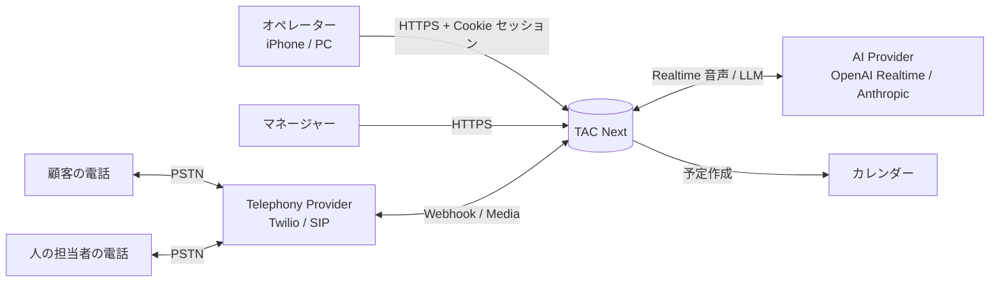
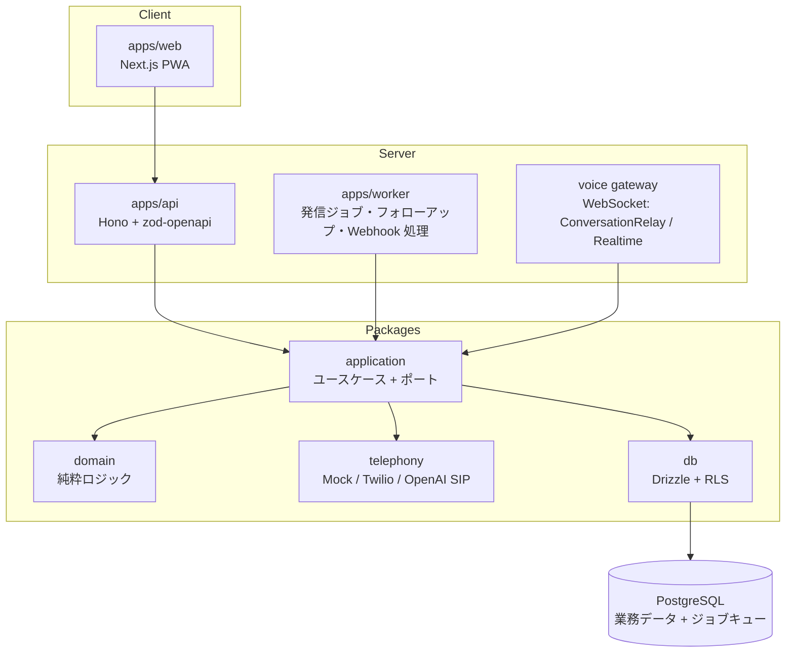
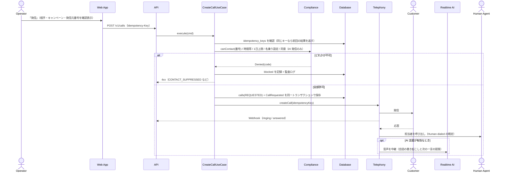
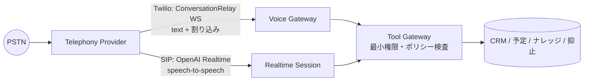
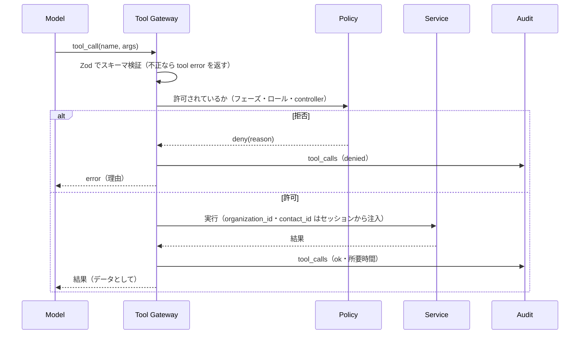
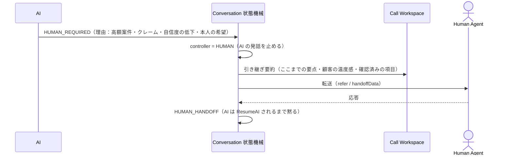
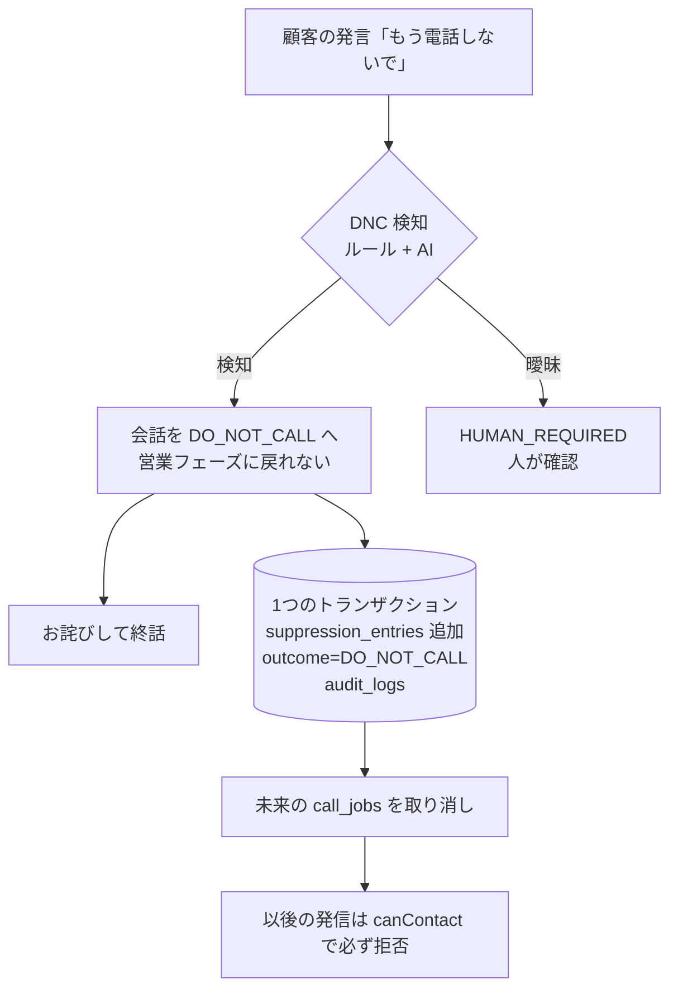

# ARCHITECTURE — 提案アーキテクチャ（G / H / I / J / K）

すべて **PROPOSED**。判断の理由は `docs/adr/` を参照。

## G. システム構成

### G-1. System Context



### G-2. Container



依存方向は `apps → application → domain` の一方向。`domain` は何にも依存しない。

### G-3. デプロイ

```mermaid
flowchart LR
  subgraph Fly.io（nrt）
    A1[api x2]
    W1[worker x1+]
    V1[voice gateway x1+]
  end
  PG[(Managed PostgreSQL<br/>PITR バックアップ)]
  A1 --> PG
  W1 --> PG
  V1 --> PG
  GH[GitHub Actions] -->|build / test / migrate| A1
```

- 業務状態はすべて PostgreSQL に置くので、api / worker は水平スケールできる（現行の単一マシン制約を解消）。
- 環境は `local / test / staging / production` に分ける。`test` では実プロバイダのアダプタを生成できない（ADR-0004）。
- 特定ベンダーに依存するのは Telephony / AI アダプタと Fly の設定ファイルだけ。コンテナは Docker 標準。

## H. データベース（ERD）

全テーブルに `organization_id` を持たせ、PostgreSQL RLS で `organization_id = current_setting('app.org_id')` を強制する
（アプリ側の絞り込みと二重にする）。

```mermaid
erDiagram
  organizations ||--o{ memberships : has
  users ||--o{ memberships : has
  organizations ||--o{ contacts : owns
  organizations ||--o{ campaigns : owns
  companies ||--o{ contacts : employs
  contacts ||--o{ phone_numbers : has
  contacts ||--o{ notes : has
  contacts ||--o{ lead_scores : scored
  contacts ||--o{ campaign_members : in
  campaigns ||--o{ campaign_members : includes
  campaign_members ||--o{ call_jobs : queued
  contacts ||--o{ calls : receives
  calls ||--o{ call_events : emits
  calls ||--o| conversations : carries
  conversations ||--o{ conversation_turns : has
  conversations ||--o{ ai_decisions : logs
  conversations ||--o{ tool_calls : logs
  calls ||--o| outcomes : results
  outcomes ||--o{ follow_ups : creates
  follow_ups ||--o| appointments : becomes
  organizations ||--o{ suppression_entries : maintains
  contacts ||--o{ consents : grants
  organizations ||--o{ audit_logs : records
  organizations ||--o{ idempotency_keys : stores
  organizations ||--o{ webhook_events : receives

  organizations { uuid id PK; text name; text timezone; jsonb policy }
  users { uuid id PK; citext email UK }
  memberships { uuid org_id FK; uuid user_id FK; text role "OWNER|ADMIN|MANAGER|OPERATOR|VIEWER" }
  contacts { uuid id PK; uuid org_id FK; text display_name; text status; text timezone; uuid company_id FK }
  phone_numbers { uuid id PK; uuid org_id FK; uuid contact_id FK; text e164 "UK(org_id,e164)"; text raw_input; text kind }
  suppression_entries { uuid id PK; uuid org_id FK; text e164 "UK(org_id,e164) WHERE lifted_at IS NULL"; text reason; text source; timestamptz created_at; timestamptz lifted_at; uuid lifted_by }
  consents { uuid id PK; uuid org_id FK; uuid contact_id FK; text scope; text legal_basis; text source; timestamptz granted_at; timestamptz revoked_at }
  campaigns { uuid id PK; uuid org_id FK; text name; text product; jsonb calling_window; int daily_cap; int budget_jpy }
  call_jobs { uuid id PK; uuid org_id FK; uuid contact_id FK; uuid campaign_id FK; int priority; timestamptz scheduled_at; int attempt; int max_attempts; text idempotency_key }
  calls { uuid id PK; uuid org_id FK; uuid contact_id FK; text to_e164; text from_e164; text status; text provider; text provider_call_id "UK(provider, provider_call_id)"; text idempotency_key "UK(org_id, idempotency_key)"; text prompt_version; text model_version; text policy_version }
  call_events { bigint id PK; uuid call_id FK; text type; jsonb payload; timestamptz occurred_at; text dedupe_key UK }
  conversations { uuid id PK; uuid call_id FK; text phase; text controller "AI|HUMAN" }
  conversation_turns { bigint id PK; uuid conversation_id FK; text speaker; text text; timestamptz at }
  outcomes { uuid id PK; uuid call_id FK "UK"; text outcome_code; text category; uuid recorded_by }
  follow_ups { uuid id PK; uuid org_id FK; uuid contact_id FK; text kind; timestamptz due_at; text status "OPEN|DONE|CANCELED" }
  audit_logs { bigint id PK; uuid org_id FK; uuid actor_id; text action; text resource; jsonb before; jsonb after; text request_id; timestamptz at }
  idempotency_keys { uuid org_id FK; text key "PK(org_id,key)"; text request_hash; jsonb response; timestamptz expires_at }
  webhook_events { text provider; text event_id "PK(provider,event_id)"; jsonb raw; timestamptz received_at; timestamptz processed_at }
```

インデックス候補：`calls(org_id, created_at desc)`、`call_jobs(org_id, scheduled_at) WHERE status='PENDING'`、
`follow_ups(org_id, due_at) WHERE status='OPEN'`、`contacts` の検索は `pg_trgm`（名前・会社）＋ `phone_numbers(e164)`。
`audit_logs` はアプリのロールに UPDATE / DELETE 権限を与えない（追記専用）。

## I. API マップ（REST + OpenAPI 3.1、`/v1`）

| メソッド | パス | ロール | 説明 |
|---|---|---|---|
| POST | `/v1/auth/login` ・ `/logout` | — | Cookie セッション（HttpOnly / Secure / SameSite=Lax）＋ CSRF トークン |
| GET | `/v1/me` | 全員 | 自分・所属組織・ロール |
| GET/POST | `/v1/contacts` | OPERATOR+ | カーソルページング。検索：名前・会社・電話・状態・結果・タグ・キャンペーン |
| GET/PATCH | `/v1/contacts/{id}` | OPERATOR+ | 詳細・メモ・連絡履歴・取り込み元データ・分類修正 |
| POST | `/v1/imports` → `/v1/imports/{id}/commit` | MANAGER+ | CSV：アップロード → 列の対応付け → 検証 → プレビュー → 重複判定 → 取り込み。失敗行は CSV でダウンロード |
| GET | `/v1/queue/next` | OPERATOR | 次に掛ける候補と「おすすめの理由」 |
| POST | `/v1/calls` | OPERATOR+ | **`Idempotency-Key` ヘッダー必須**。CreateCallUseCase を通す |
| GET | `/v1/calls/{id}` ・ `/v1/calls/{id}/events`（SSE） | OPERATOR+ | 通話の状態・文字起こしのライブ配信 |
| POST | `/v1/calls/{id}/control` | OPERATOR+ | `take_over / mute_ai / resume_ai / transfer / hang_up` |
| POST | `/v1/calls/{id}/outcome` | OPERATOR+ | 結果の記録 → フォローアップ・抑止の生成 |
| GET/PATCH | `/v1/follow-ups` | OPERATOR+ | 連絡予定・再調整希望・要確認・対応済み |
| GET/POST/DELETE | `/v1/suppressions` | OPERATOR 追加 / ADMIN 解除 | 解除には理由が必須（監査ログ） |
| GET | `/v1/analytics/*` | MANAGER+ | ファネル・結果の分布・取得元別・担当者別・時間帯別 |
| GET | `/v1/exports/calls.csv` | ADMIN+ | エクスポート操作自体も監査ログに残す |
| POST | `/v1/webhooks/{provider}` | 署名検証 | 署名・タイムスタンプ検証 → 生データ保存 → 重複排除 → 非同期で処理 |

エラーの形式は統一する：`{"error":{"code":"CONTACT_SUPPRESSED","message":"…","requestId":"…"}}`（スタックトレースは返さない）。

### 発信のシーケンス（Call Sequence）



## J. 音声アーキテクチャ



| 論点 | 方針 |
|---|---|
| 方式 | 第1段：現行と同じ Twilio ConversationRelay（Twilio 側で音声認識・音声合成・割り込みを処理。日本語は ja-JP-Neural2-B で実績あり）。第2段：OpenAI Realtime の SIP 接続（speech-to-speech で低遅延。`realtime.call.incoming` → accept / refer / hangup）。モデル名は実装時に公式ドキュメントで確認する |
| VAD / 話者交代 | プロバイダ側のサーバー VAD を使う。こちらは割り込み（interrupt）を受けたら、生成中の応答を破棄する |
| 割り込み（barge-in） | ConversationRelay の `interrupt` メッセージ／Realtime の発話開始イベントを受けたら、送信中のテキストをやめ、会話履歴は「実際に再生された部分まで」に切り詰める |
| 無音 | 8 秒で確認の一言、さらに 8 秒で終話の挨拶をして WRAP_UP へ |
| ツール呼び出し | すべて Tool Gateway を通す（K 参照） |
| 人への引き継ぎ | ConversationRelay：`{"type":"end","handoffData":"…"}` → `<Connect action>` のコールバックで担当者へ。SIP：`/refer` で担当者番号へ転送 |
| 終話 | 状態機械が COMPLETED になったら provider.endCall |
| DTMF | 受信はイベントとして記録し、会話の入力にはしない（番号入力の誘導は将来） |
| 留守電の判定 | 留守電を検知したら（Twilio AMD）伝言を残さず NO_ANSWER / VOICEMAIL にする（無断の録音メッセージを残さない） |
| タイムアウト | 1通話の最長時間（キャンペーン設定、既定 15 分）。AI の応答が 3 秒以上かかったらつなぎの一言を入れ、10 秒で HUMAN_REQUIRED |
| 回線断 | WebSocket が切れたら通話を FAILED にして、未記録の会話を保存する。自動で掛け直さない |

## K. AI アーキテクチャ

### プロンプトの層（1つの巨大な system prompt にしない）

| 層 | 内容 | 変更する人 | バージョン |
|---|---|---|---|
| Global Safety Policy | 拒否の尊重・虚偽の禁止・AI であることの開示・緊急時の対応 | 開発（コード） | `safety@x.y` |
| Organization Policy | 会社名・営業時間・言ってはいけないこと | Admin | 組織設定の版 |
| Campaign Policy | 商材・目的・ヒアリング項目 | Manager | キャンペーンの版 |
| Agent Persona | 「さくら」の話し方（現行 #124〜#126 の調整を引き継ぐ） | Admin | persona の版 |
| Conversation State | 今のフェーズと、このフェーズで許される行動 | 状態機械が生成 | — |
| Tool Policy | このフェーズで使えるツール | コード | — |
| Dynamic Context | 顧客情報・ナレッジの検索結果（**信頼しないデータとして区切って渡す**） | 実行時 | — |

通話ごとに `prompt_version / model_version / policy_version` を `calls` に保存する。

### ツール（最小権限）

| ツール | 種別 | 制約 |
|---|---|---|
| `get_contact` ・ `get_company` ・ `search_knowledge` ・ `get_availability` | 読み取り | 通話中の相手のデータに限る（ID はサーバー側で固定し、モデルには選ばせない） |
| `create_follow_up` | 書き込み | 日時の妥当性を検査。重複作成は冪等キーで防ぐ |
| `request_handoff` | 書き込み | いつでも使える |
| `mark_do_not_call` | 書き込み | 呼ばれたら必ず成功させる（取り消しは人だけ）。実行後は会話を終える |
| `book_appointment` | 書き込み | 担当者の承認（Human confirmation）を経てから確定する |



### 人への引き継ぎ（Human Handoff）



### 抑止（DNC）のフロー



DNC の検知は**ルール（キーワード）を先に、AI の判定を後に**評価し、どちらかが検知したら抑止する（取りこぼしを避ける側に倒す）。
