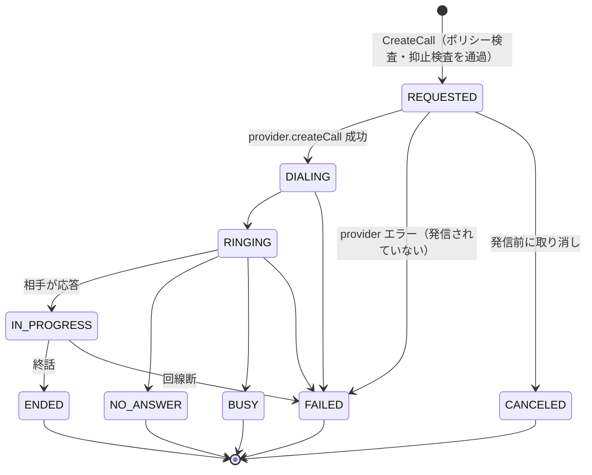
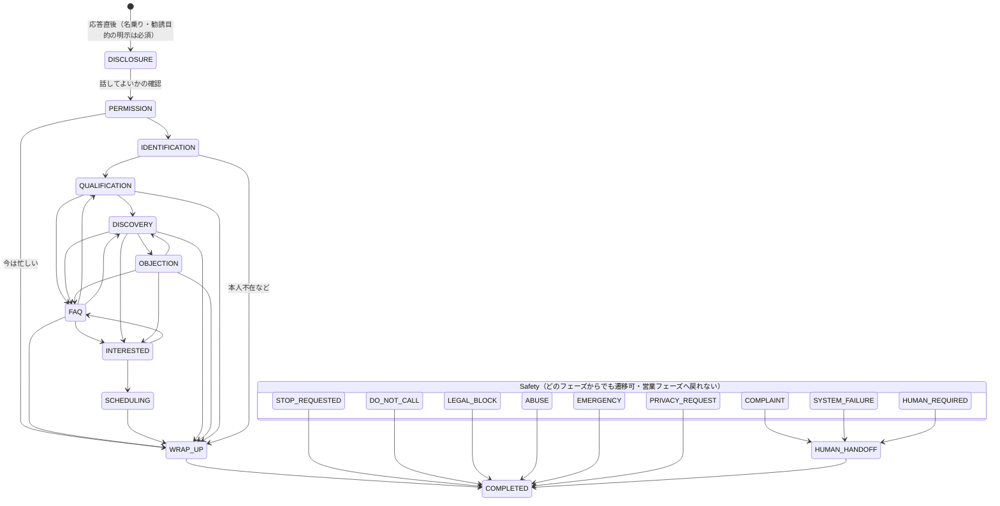
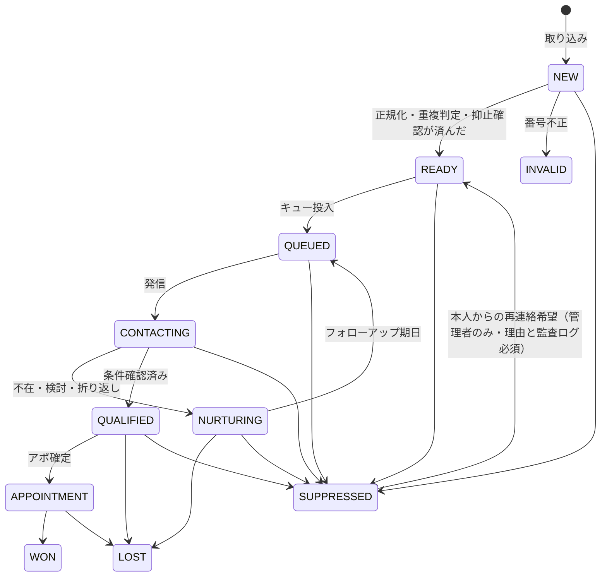

# DOMAIN — ドメインモデルと状態機械（E / F）

すべて **PROPOSED**（新システムの設計）。現行からの由来は EXISTING_APP_AUDIT.md を参照。

## E. ドメインモデル

### 境界づけられたコンテキスト

| コンテキスト | 責務 | 主な集約 |
|---|---|---|
| Identity & Tenancy | 組織・ユーザー・ロール・セッション | Organization, User, Membership |
| Leads (CRM) | 顧客・会社・電話番号・取得元・タグ・メモ | Contact, Company, PhoneNumber, Note |
| Scoring & NBA | スコアの分解、次アクションの判定と根拠 | LeadScore, NextBestAction |
| Compliance | 抑止（DNC）・同意・発信時間帯・名乗り・録音・保存期間 | SuppressionEntry, Consent, CompliancePolicy |
| Calling | キュー・通話・通話イベント・冪等性 | CallJob, Call, CallEvent |
| Conversation | 会話フェーズ・発話・要約・AI 判断・ツール呼び出し | Conversation, Turn, AiDecision, ToolCall |
| Outcomes & Follow-up | 結果分類・タスク・再架電・アポ | Outcome, FollowUp, Appointment |
| Audit & Analytics | 監査ログ・KPI | AuditLog, MetricEvent |

### 値オブジェクト（不変・検証済み）
- `E164`：`+` と 8〜15 桁の数字。国内表記（`090-1234-5678`）は入口で正規化し、表示形式とは分けて保存する。
- `OrganizationId` / `ContactId` / `CallId`：ブランド型（取り違えをコンパイル時に防ぐ）。
- `IdempotencyKey`：1〜255 文字。発信要求ごとに必須。
- `OutcomeCode`：組織ごとに拡張できる分類コード（下記）。

### 結果（Outcome）の分類

現行の5ボタンは**初期プリセット**として残し、内部では分類コードで扱う。

| 表示（プリセット） | outcome_code | category | requires_followup | requires_suppression | next_action |
|---|---|---|---|---|---|
| 成約 | `WON` | POSITIVE | false | false | `NONE` |
| 検討 | `INTERESTED` | POSITIVE | true | false | `FOLLOW_UP`（既定 3 日後） |
| 折り返し | `CALLBACK_REQUESTED` | NEUTRAL | true | false | `CALL_LATER`（日時必須） |
| 不在 | `NO_ANSWER` | NO_CONTACT | true | false | `CALL_LATER`（再試行ポリシー） |
| 拒否 | `DO_NOT_CALL` | NEGATIVE | false | **true** | `DO_NOT_CONTACT` |
| （追加）アポ確定 | `APPOINTMENT_SET` | POSITIVE | true | false | `SCHEDULE` |
| （追加）番号違い | `WRONG_NUMBER` | INVALID | false | 番号のみ抑止 | `HUMAN_REVIEW` |
| （追加）留守電 | `VOICEMAIL` | NO_CONTACT | true | false | `CALL_LATER` |

`requires_suppression = true` の結果は、記録と**同じトランザクション**で抑止リストに登録する。

### 次アクション（Next Best Action）
`CALL_NOW | CALL_LATER | FOLLOW_UP | SEND_MESSAGE | SCHEDULE | HUMAN_REVIEW | DO_NOT_CONTACT`
それぞれに `reason`（人が読める説明）・`confidence`（0〜1）・`decided_by`（rule / ai / human）・`policy_version` を保存する。
抑止中の相手は、どの入力からでも必ず `DO_NOT_CONTACT` になる（スコアより優先）。

### スコア（説明可能性が必須）
現行 sales-rank の3軸（会える確度・属性の質・審査適性）を引き継いで分解する。

| 要素 | 意味 | 現行との対応 |
|---|---|---|
| `contactability` | つながる・会える見込み | 会える確度 |
| `fit` | 提案できる物件価格帯との合致（年収・貯蓄・借入） | 属性の質 |
| `eligibility` | ローン審査を通る見込み（勤続・既存借入） | 審査適性 |
| `intent` | 本人の温度感（問い合わせ内容・会話での発言） | 電話5問 |
| `freshness` | 最終接触からの経過 | — |
| `engagement` | 過去の応答・折り返し実績 | — |

`priority = Σ(weight_i × score_i)` に加え、**要素ごとの寄与と理由の文章**を返す。
「なぜおすすめか」は寄与の大きい上位の要素から作る。重みは組織ごとの設定値で、変更はバージョン管理する。

## F. 状態機械

### F-1. 通話（Call）のライフサイクル — 電話回線の状態

- 終端状態（ENDED / FAILED / NO_ANSWER / BUSY / CANCELED）からの遷移はすべて禁止。
- Webhook の順番が入れ替わっても（例：RINGING より先に ENDED が届く）、終端状態を後退させない。
  遅れて届いた古いイベントは `call_events` に記録だけして、状態は変えない。

### F-2. 会話フェーズ（Conversation）— AI / 人が何をしている段階か

規則（すべてテストで固定する）：
1. **DISCLOSURE → PERMISSION を飛ばせない**：応答直後は名乗りから始まり、相手に話してよいかを確かめるまで本題に入らない。
2. **Safety は最優先**：営業フェーズのどこからでも Safety 状態へ遷移できる。Safety から営業フェーズへは戻れない。
3. **DO_NOT_CALL / STOP_REQUESTED に入ったら**、ただちに会話終了 → 抑止登録 → 監査ログの副作用を発行する。
4. **制御者（controller）**：`AI` か `HUMAN`。HUMAN が引き継いだ後、AI は人が明示的に `ResumeAI` しない限り発話できない
   （Human override は AI の判断より優先）。
5. Safety の中でも優先順位がある：`EMERGENCY > LEGAL_BLOCK > DO_NOT_CALL > STOP_REQUESTED > PRIVACY_REQUEST > COMPLAINT > ABUSE > SYSTEM_FAILURE > HUMAN_REQUIRED`。
   `COMPLAINT`（クレーム）と `SYSTEM_FAILURE`（AI・音声の障害）は人へ渡す。拒否より優先されることはない。
6. 依頼文の例との対応：`INTRODUCTION` ＝ `DISCLOSURE`（名乗りを含む）、`HANDOFF` ＝ `HUMAN_HANDOFF`、`STOPPING` ＝ Safety 状態からの終話処理。
   同時に検知したら高いほうを採る。

### F-3. 見込み客（Lead）のライフサイクル

`SUPPRESSED` への遷移はどこからでも可能で、解除は Admin 以上の明示操作だけにする（理由は必須で、監査ログに残す）。
