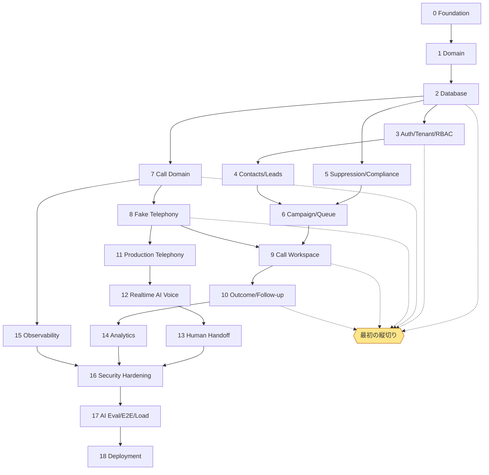

# IMPLEMENTATION_PLAN — 実装計画

会話の文脈が途切れたら、`PROGRESS.md` → この文書 → `ARCHITECTURE.md` → `DECISIONS.md` の順に読んで、現在地から再開する。
Agent の役割と手順は [`../AGENTS.md`](../AGENTS.md)・[`AI_WORKFLOW.md`](AI_WORKFLOW.md)。各 Phase の User Stories / 受け入れ条件 / Security / Tests / DoD は、その Phase の開始時に、下の「Phase 0 仕様」と同じ形で書き足す（未着手の Phase を推測で埋めない）。

## 進め方
- 各 Phase は **DISCOVER → AUDIT → MODEL → DESIGN → SPECIFY → TEST → IMPLEMENT → VERIFY → HARDEN → DEPLOY** の順に進める。
- 機能ごとに **User Story → 受け入れ条件 → 失敗ケース → 失敗するテスト → RED 確認 → 最小の実装 → GREEN 確認 → リファクタ → 結合テスト** を回す。
- 縦切り（Vertical Slice）で進める。DB だけ・UI だけを先に全部作らない。
- 各 Phase の開始時に「Goal / User stories / Domain rules / 受け入れ条件 / 失敗ケース / Security / Tests / 影響するファイル / DoD」を書き、
  終了時に `PROGRESS.md` を更新する。

## 承認なしに実行しないこと
実在の顧客への発信／本番 DB の削除／元に戻せない本番マイグレーション／大量の課金処理／本番シークレットの変更／実在の顧客への AI 自動発信。

## Phase 一覧

| Phase | 内容 | 主な成果物 | 完了の条件 | 状態 |
|---|---|---|---|---|
| 0 | Foundation | pnpm workspace・TS strict・Biome・Vitest・CI・検証つき設定（config） | `pnpm check` と `pnpm build` が通り CI がグリーン | **完了** |
| 1 | Domain | 電話番号・通話/会話の状態機械・Safety・発信ガード・結果・時間帯・スコア | 純粋ロジックの必須テストが通る | **完了** |
| 2 | Database | Drizzle スキーマ・マイグレーション・RLS・Repository（PGlite で結合テスト） | テナント分離・DNC が再起動後も残る・1日上限の競合なし | **完了**（PR #133） |
| 3 | Auth / Tenant / RBAC | Cookie セッション・CSRF・ロール | 権限ごとの API テスト | **一部**（ログイン・セッション・CSRF・ロール・HTTP 骨格。ユーザー管理・ログインの制限は未実装） |
| 4 | Contacts / Leads | 一覧・検索・カーソルページング・CSV 取り込み/出力・顧客詳細・メモ | 取り込みウィザードの結合テスト | 未着手 |
| 5 | Suppression / Compliance | 抑止の永続化・解除（Admin＋理由）・ポリシー設定 | 抑止の解除が監査に残る | 一部（ドメインのみ） |
| 6 | Campaign / Queue | キャンペーン・Postgres ベースのキュー・worker・再試行 | 時間外はキューにあっても発信しない | 一部（キュー照会のみ） |
| 7 | Call Domain | 通話の永続化・Webhook 受信（重複排除・順序の入れ替え） | 重複/順序違いの Webhook で状態が壊れない | **完了**（mock の Webhook。実プロバイダは Phase 11） |
| 8 | Fake Telephony | シミュレーター（VOICE.md の9シナリオ） | 全シナリオのテスト | **一部**（9 シナリオのテストは済。voicemail の扱い・会話の記録・再試行は後続） |
| 9 | Call Workspace | Next.js PWA：Dashboard・Leads・Call Workspace | 最初の縦切りの E2E | **一部**（ログイン・リード（最小）・Call Workspace（人の発信）・結果と E2E。Dashboard・Follow-ups・文字起こし・引き継ぎは後続） |
| 10 | Outcome / Follow-up | 結果・フォローアップの API と UI | 結果 → フォローアップの E2E | 一部（ユースケース） |
| 11 | Production Telephony | Twilio アダプタ（現行の番号・KYC を引き継ぐ） | コントラクトテスト＋staging で実通話 1 件（**承認が必要**） | 未着手 |
| 12 | Realtime AI Voice | ConversationRelay → OpenAI Realtime SIP | AI Eval 合格（DNC の取りこぼし 0） | 未着手 |
| 13 | Human Handoff | Take Over・Mute・Resume・Transfer | 引き継ぎ後に AI が話さない E2E | 一部（ドメインのみ） |
| 14 | Analytics | 営業・音声・AI の KPI | 集計テストと一致 | 未着手 |
| 15 | Observability | OpenTelemetry（request_id / trace_id / organization_id / campaign_id / contact_id / call_id / conversation_id） | 1通話を端から追える | 未着手 |
| 16 | Security Hardening | ASVS・CSP・レート制限・ZAP | 重大な指摘 0 | 未着手 |
| 17 | AI Eval / E2E / Load | CI で自動実行 | main で常時グリーン | 未着手 |
| 18 | Deployment | staging → production・バックアップの復元テスト・Runbook | 本番前チェックリスト完了（**承認が必要**） | 未着手 |

**最初の縦切り**（Phase 2・3・7・8・9・10 を薄く貫く）：
Contact → 電話番号の正規化 → 抑止 → 発信要求 → Fake Telephony → 通話のライフサイクル → 結果 → フォローアップ を、UI / API / DB / テストまで完成させる。
最初の縦切りは画面まで通った（ログイン → リード → 発信 → シミュレーターの Webhook → 状態 → 結果 → 発信禁止）。フォローアップの画面が残り。

## タスクグラフ

## Phase 0 仕様（Foundation）

| 項目 | 内容 |
|---|---|
| Goal | 誰が clone しても同じ手順で install → check → build でき、設定の誤りが起動時に必ず分かる土台 |
| User stories | 開発者として、`pnpm install && pnpm check && pnpm build` だけで検証したい／運用者として、設定漏れ・危険な設定のまま起動してほしくない |
| Domain rules | (1) local / test では電話プロバイダは mock だけ (2) staging / production では DATABASE_URL・SESSION_SECRET が必須 (3) 安全装置（署名検証・発信時間帯）は既定で ON (4) シークレットはログや例外に出さない |
| 受け入れ条件 | 不正な設定はどの項目が悪いかを示して起動失敗する／既定値で起動すると安全側の値になる／設定オブジェクトを文字列化してもシークレットが出ない |
| 失敗ケース | 数値の項目に文字列・未知の APP_ENV・test で TELEPHONY_PROVIDER=twilio・production で SESSION_SECRET が短い |
| Security | 現行 TAC の「安全装置が既定で OFF」「不正な値で import 時にクラッシュ」の反省（監査の問題 #10） |
| Tests | `packages/config/test/config.test.ts`（RED → GREEN） |
| 影響するファイル | `packages/config/*`・`package.json`（build）・CI（build を追加）・`.nvmrc` |
| DoD | `pnpm check`・`pnpm build` がローカルと CI で通る／PROGRESS.md 更新 |

## Phase 3・7・8 仕様（HTTP 骨格・認証・発信 API・Webhook 受信・電話シミュレーター）

| 項目 | 内容 |
|---|---|
| Goal | 最初の縦切りを HTTP まで通す：ログイン → `POST /v1/calls` → シミュレーターの Webhook → 通話の状態 → `POST /v1/calls/{id}/outcome` |
| User stories | 担当者として、自分のアカウントでログインし、自分の組織の相手にだけ発信したい／管理者として、閲覧専用の人に発信させたくない／運用者として、偽の Webhook・重複・順序違いで通話の状態が壊れてほしくない |
| Domain rules | (1) organization_id はセッションから取る（リクエストの値を信用しない）(2) 発信は OPERATOR 以上、`Idempotency-Key` 必須 (3) 状態を変える要求は CSRF トークン必須 (4) Webhook は署名＋5 分以内のタイムスタンプ、`(provider, event_id)` で重複排除、終端状態は後退させない (5) mock の Webhook 受け口は local / test だけ |
| 受け入れ条件 | 権限ごとの API テスト／別テナントの ID は 404／抑止中は 422 `CONTACT_SUPPRESSED`／同じキー・違う内容は 409／偽の署名・古いタイムスタンプは 401／重複・遅延・順序違いの Webhook で最終状態が正しい／同時に届いた Webhook で状態が後退しない／VOICE.md のシミュレーターのシナリオ |
| 失敗ケース | パスワード違い・存在しないユーザー（同じ応答）・期限切れ／取り消し済みのセッション・CSRF なし・VIEWER の発信・不正な JSON・巨大な本文・未知のプロバイダ |
| Security | パスワードは scrypt（N=2^17, r=8, p=1）。セッション ID は 256 bit の乱数を HMAC でハッシュして保存（DB が漏れてもセッションを奪えない）。Cookie は HttpOnly・SameSite=Lax・production で Secure。ログイン時に新しいセッション（固定化対策）。アプリのロールは users・sessions・webhook_events を直接読めず、SECURITY DEFINER 関数だけを通す。エラーにスタック・SQL を出さない |
| Tests | `apps/api/test/*`（PGlite＋シミュレーター）・`application/test/provider-events.test.ts`・`db/test/*`（認証・Webhook の関数・状態の compare-and-set） |
| 影響するファイル | `apps/api`（新規）・`packages/application`（Webhook のユースケース・状態の compare-and-set）・`packages/db`（0003 マイグレーション）・`packages/telephony`（シミュレーター）・`packages/config`（`MOCK_WEBHOOK_SECRET`） |
| DoD | `pnpm check`・`test:critical`・`test:mutation`・`test:postgres`・`build` が CI で通る／`API.md`・`PROGRESS.md` 更新 |
| 範囲外（後続） | ログイン試行のレート制限・アカウントロック（Phase 16）、OpenAPI の自動生成（`@hono/zod-openapi`、Phase 4 で導入）、ユーザー招待・パスワード再設定（Phase 3 の続き）、会話の記録（Phase 12）、不在の再試行ポリシー（Phase 6） |

## Phase 9 仕様（最初の画面：ログイン → リード → Call Workspace → 結果）

| 項目 | 内容 |
|---|---|
| Goal | 担当者がブラウザだけで「ログイン → 相手を選ぶ → 発信（Mock）→ 状態を見る → 結果を残す」を完了できる。画面の判断は表示だけで、可否はサーバーが決める |
| User stories | 担当者として、発信禁止の相手には発信ボタンが出ないでほしい／連打しても二重に掛からないでほしい／通話の状態を文字・アイコン・色で知りたい／結果は最小の操作で残したい |
| Domain rules | (1) React に業務ロジックを書かない（`packages/workspace` を使う）(2) 楽観的 UI にしない（発信・結果はサーバーの確定を待つ）(3) 状態は色だけで表さない (4) 発信は人が押す |
| 受け入れ条件 | SCREEN_SPEC §11 の E2E 1（AI・引き継ぎを除く）・2・3・6（axe で重大な違反 0） |
| 失敗ケース | 発信禁止の相手（ボタンなし＋ API も 422）・連打・未ログイン（ログインへ）・API の失敗（`errorCopy`） |
| API の追加 | `GET /v1/contacts`（カーソル、名前順）・`GET /v1/contacts/{id}`（抑止の状態つき、照会失敗は UNKNOWN）・`GET /v1/campaigns`。検索・絞り込み・取り込みは Phase 4 |
| local の補助 | mock の Webhook を自分の API へ自動で届ける（署名つき）・`DEV_SEED_PASSWORD` でデモ用の組織・担当者・リードを作る（local / test だけ、staging / production では起動しない） |
| 範囲外（後続） | Dashboard・Follow-ups の画面・文字起こし・AI の状態・引き継ぎ（Phase 12・13）・ダークモードの手動切り替え・Storybook・SSE（今はポーリング） |
| Tests | `apps/api/test/*`（新しい API）・`apps/web/e2e/*`（Playwright＋axe） |
| DoD | 上の E2E が CI で通る／`SCREEN_SPEC`・`PROGRESS` 更新 |

## 現行システムからの移行
- 現行 TAC（Python）は、新システムの Twilio アダプタ（Phase 11）が staging で動くまで本番で使い続ける。
- 移行するデータ：`dnc.txt`（**最優先・欠落させない**）→ `suppression_entries`、`calls.jsonl` → `calls` / `call_events`、
  `screenings.jsonl` → `lead_scores`。移行スクリプトは件数照合のテストつきで作る。
- 番号の Voice Webhook を新システムへ向ける切り替えは、1 番号ずつ行い、すぐ戻せるようにする。

## リスク一覧

| リスク | 起こりやすさ | 影響 | 対策 | 検知 | 担当 |
|---|---|---|---|---|---|
| 法令違反（名乗り不足・再勧誘） | 中 | 致命的 | DisclosurePolicy で発信を止める・抑止の強制・法務確認 | blocked の記録・監査ログ | Owner |
| 個人情報の漏えい | 中 | 致命的 | RLS・RBAC・PII マスキング・エクスポートの監査 | 監査ログ・異常なエクスポートのアラート | Security |
| AI のハルシネーション | 高 | 高 | ナレッジにない内容は断定しない規則・引き継ぎ・AI Eval | 会話の抜き取り確認・Eval の回帰 | AI |
| 二重発信 | 中 | 高 | Idempotency-Key・`calls(org_id, idempotency_key)` の一意制約・UI の二重クリック防止 | 同じ番号への短時間の重複発信アラート | Backend |
| DNC の取りこぼし | 中 | 致命的 | ルール＋AI の両方で検知（取りこぼさない側に倒す）・発信直前の canContact | Eval・抑止後の発信 0 件を監視 | Compliance |
| プロバイダの停止 | 中 | 高 | アダプタの差し替え・サーキットブレーカー・AI が止まったら人につなぐ | ヘルスチェック・エラー率 | SRE |
| 遅延（音声） | 高 | 中 | speech-to-speech・つなぎの一言・地域（nrt） | time_to_first_audio の p95 | Voice |
| コストの暴走 | 中 | 高 | 1日上限・同時通話数・通話の最長時間・予算上限 | 費用メトリクスのアラート | Owner |
| データの漏えい（ログ） | 中 | 高 | ログに PII を出さない・マスキングのテスト | ログ走査 | SRE |
| プロンプトインジェクション | 高 | 中 | 入力を信頼しないデータとして扱う・ツール権限をコードで強制 | Eval のインジェクションシナリオ | AI |
| テナント間の漏えい | 低 | 致命的 | アプリのスコープ＋RLS の二重化 | 結合テスト | Backend |
| Webhook の重複・順序の入れ替え | 高 | 中 | `(provider, event_id)` での重複排除・終端状態を後退させない | 重複率のメトリクス | Backend |
| 移行時の DNC の欠落 | 低 | 致命的 | 件数照合のテスト・移行後の突き合わせ | 移行レポート | Owner |

| 緊急停止が効かない | 低 | 致命的 | 全発信停止・組織/キャンペーンの一時停止を発信ガードの先頭で評価（ADR-0006） | 停止中の発信 0 件を監視 | Owner |
| AI が抑止をすり抜ける | 低 | 致命的 | 発信系の操作は必ず CreateCallUseCase を通す・ツールに発信権限を与えない | Eval・監査ログ | AI |

## Definition of Done（Production-ready）
認証が動く／テナント分離が動く／リード管理が動く／抑止が動く／発信の作成が動く／Fake Telephony が動く／
設定すれば本番アダプタが動く／通話のライフサイクルが保存される／結果が動く／フォローアップが動く／有効にすれば AI 音声が動く／
人への引き継ぎが動く／監査ログが動く／分析が動く／観測が動く／重要な E2E が通る／セキュリティテストが通る／ビルドが通る／デプロイ手順が検証済み。
