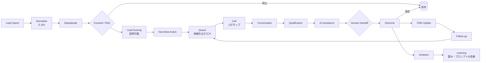

# PRODUCT — プロダクトビジョン

区分：**PROPOSED**（現行からの由来は [EXISTING_APP_AUDIT.md](EXISTING_APP_AUDIT.md)）

## 何を作るか
**AI + Human Hybrid Sales Engagement Platform**。
「電話をかける画面」ではなく、リードの取り込みから学習までの営業ループ全体を、安全と法令順守を最優先にして支える。

現行 TAC が現場で解決している問題（誰に掛けるか → 掛ける → 話す → 結果を残す → 次の予定 → 履歴 → 断った人には掛けない）を引き継ぎ、
技術的負債（単一プロセス・ファイル保存・共有トークン・プロセス内の会話状態）は引き継がない。

## 中心となるワークフロー

## 優先順位（迷ったらこの順で決める）
1. Safety
2. Compliance
3. Correctness
4. Reliability
5. Operator UX
6. Conversion
7. AI Autonomy

AI の自律性のために、上位の項目を犠牲にしない。

## 利用者

| 役割 | 主な目的 | 主な画面 |
|---|---|---|
| Operator（架電担当） | 速く・迷わず・安全に1件ずつ掛ける | Dashboard・Call Workspace・Follow-ups（iPhone 中心） |
| Manager | リスト・キャンペーン・成果の管理 | Leads・Analytics・取り込み |
| Admin / Owner | 法令設定・権限・監査・抑止の解除 | Settings・監査ログ |
| 顧客（電話の相手） | 不快な思いをしない・断ったら二度と掛かってこない | 電話そのもの |

## 主要な画面
`Dashboard / Calls / Leads / Follow-ups / Conversations / Analytics / Settings`

**Call Workspace**（通話中の専用画面）：顧客プロフィール・会社・通話状態と経過時間・AI の状態（聞いている／考え中／話している／CRM を検索中／引き継ぎ準備中）・
ライブ文字起こし・「なぜおすすめか」・次の一言の提案・ナレッジ・メモ・ミュート・Take Over・転送・終話・結果・次のアクション。

**発信ボタンを押す前に**「誰に」「どのキャンペーンで」「どの番号から」掛けるかを表示し、二重タップを防ぐ。

## AI と人の役割分担
[AI_AGENT.md](AI_AGENT.md) を参照。要点：AI は一次会話・ヒアリング・FAQ・要約・CRM 補助・日程候補まで。
重要商談・契約・例外・クレーム・センシティブな相談・高額案件・AI の自信度低下は人が担当する。

## やらないこと（Non-goals）
- 予測発信（predictive dialer）・人の確認なしの連続発信
- 同意のない相手への AI 音声による発信（ADR-0003）
- 留守番電話への自動の伝言
- 法的な判断を AI に確定させること

## ユーザージャーニー

1. **朝の架電（オペレーター・iPhone）**：ログイン → Dashboard で今日のフォローアップ件数を見る → 「次の候補」を開く →
   「なぜおすすめか」（例：勤続9年・年収650万・3日前に資料請求）を読む → 発信の確認（誰に／どのキャンペーンで／どの番号から）→ 発信 →
   相手が出たら自分の電話が鳴る → 通話中は Call Workspace でメモ → 結果ボタン → 次のアクションが自動で作られる → 次の候補へ。
2. **断られたとき**：相手が「もう電話しないで」→「拒否」を押す → 確認 → 抑止に入り、未来のキューからも消える →
   以後、誰がどの画面から発信しようとしても `CONTACT_SUPPRESSED` で止まる。
3. **着信（顧客 → さくら）**：さくらが名乗って用件を聞く → 電話5問を自然に聞く → 高額案件・クレーム・本人の希望なら人へ引き継ぐ
   （要約つき）→ 折り返しを約束したら、実際にフォローアップが作られる。
4. **リストの取り込み（マネージャー）**：CSV をアップロード → 列の対応付け → 検証（番号不正・重複・抑止中）→ プレビュー →
   取り込み → 失敗した行を CSV でダウンロード。
5. **監査対応（Owner）**：期間を指定して通話記録をエクスポート（操作自体も監査ログに残る）→ 抑止の追加・解除の履歴を確認。
6. **緊急停止（Owner）**：問題が起きたら「全発信を停止」を押す → 進行中の発信要求はすべて `OUTBOUND_STOPPED` で止まる →
   原因を確認してから再開（再開も監査ログに残る）。
