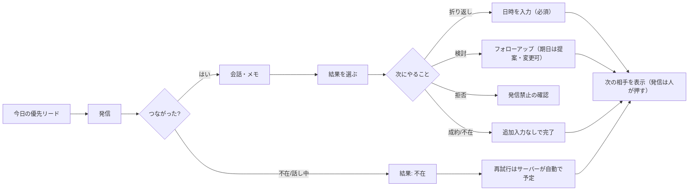
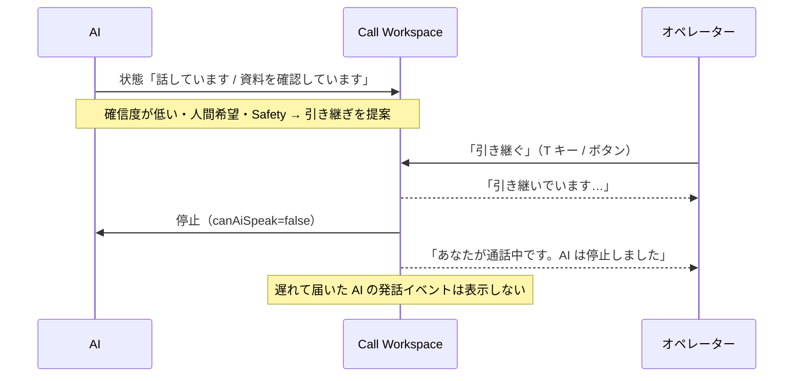
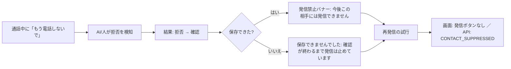
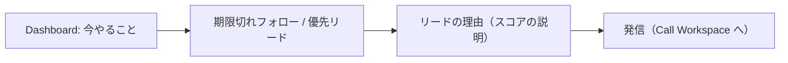
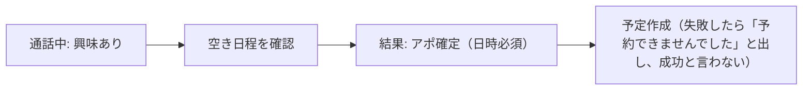

# UX — 体験設計（既存 TAC の UX 監査・原則・ユーザージャーニー・情報設計）

関連：画面ごとの仕様は [`SCREEN_SPEC.md`](SCREEN_SPEC.md)、見た目と部品は [`DESIGN_SYSTEM.md`](DESIGN_SYSTEM.md)。
画面に依存しない表示ロジックは `packages/workspace`（React に業務ロジックを書かない）。

## 目標
「きれいなダッシュボード」ではなく、**オペレーターが次に何をすべきか迷わず、最小の操作で電話業務を終えられ、AI の状態が分かり、必要なら一瞬で人が介入でき、危険な発信を防げる**営業ワークスペース。
既存 TAC のシンプルさは失わない。増えた機能は Progressive Disclosure・文脈に応じた操作・強い情報の階層で隠す。

## 1. 既存 TAC の UX 監査
**対象と根拠**：本番 `https://tac-martial-arts.fly.dev/tac/app` は開発環境から接続できない（UNKNOWN）。
そのため `feature/sakura-max` の `telegram-ai-bot/tac/mobile_app.py`（1197 行・1枚の HTML の PWA）と `DESIGN_sakura_max.md` から監査した。本番に出ているブランチがこれと同じかは UNKNOWN。

### OBSERVED（ソースで確認）
| 観点 | 内容 |
|---|---|
| 情報設計 | 下部タブ5つ：発信・リスト・フォロー・記録・設定（`role="tablist"`）。幅 480px の1カラム。ヘッダーにロゴ（🔥）と名前「自動フォロー」 |
| 発信の流れ | 番号を入力（`type="tel"`）＋担当者を選ぶ → 「📞 発信する」→ 担当者の電話が鳴る（click-to-call の会議ブリッジ）→ 結果カードが出る |
| 結果入力 | 5ボタン（成約・検討・折り返し・不在・拒否）＋メモ。折り返しは日時入力が開く。**拒否は `confirm()` の後に DNC 登録**。結果の保存とメモの保存は別リクエスト |
| リスト | サーバーのキュー（名前・エリア・スコア、検索、スコア順/名前順/おすすめ順）と、手入力の番号リスト（「この番号に発信」「スキップ」「n / N 件目」） |
| 連続モード | トグル ON のとき、結果を記録すると **0.5 秒後に次の番号へ自動で発信**する（`setTimeout(dial, 500)`）。冒頭のコメントは「オートダイヤラーではない」としているが、この挙動は実質パワーダイヤラー |
| フォロー | 自動フォローのエンジン（ON / 一時停止 / OFF）、次の1件のプレビュー（お客様・分類・番号・判定の根拠）、「この1件に発信」、**赤い「▶ 連続で自動発信（止まらない）」**、無人オート運転 ON/OFF、4つの集計（連絡予定・再調整希望・要確認・対応済み）、お客様の詳細シート（タイムライン・分類の修正・連絡停止） |
| 記録 | 今日の発信数・状態別の件数・発信/成約/成約率、担当者別の SVG 棒グラフ、折り返し予定、直近の発信 |
| 設定 | 操作者トークンの入力だけ（`localStorage` に平文で保存し `X-TAC-Token` で送る） |
| フィードバック | `role="status" aria-live="polite"` のメッセージ欄。送信中はボタンを `disabled`（連打対策はクライアントだけ） |
| 安全 | 外部の値は `textContent` で入れる（XSS 対策）。危険な操作はブラウザ標準の `confirm()` |
| 見た目 | 炎ブランド（`#c2410c`）、ダークモード（`prefers-color-scheme`）、角丸 16px のカード、48px 以上のタップ領域、絵文字アイコン |
| PWA | manifest・アイコン・`apple-mobile-web-app-capable`。オフライン対応（Service Worker）は見当たらない |

### INFERRED（推測）
- 主な利用はスマホ（iPhone のホーム画面に追加）。PC での通話中の作業（メモ・履歴の参照）は想定が薄い
- **通話中の状態が画面に無い**（click-to-call で担当者の電話が鳴るだけ。呼び出し中・通話中・終了が分からない）。結果カードは「発信した」時点で出る
- 結果の画面状態はメモリだけにあり、通話中にリロードすると結果カードが消える
- 「拒否」1 タップ＋confirm で DNC 登録、の速さは現場に好まれている

### UNKNOWN
本番の実画面・実際の利用端末の比率・1日の発信件数・1件あたりの所要時間・連続モードと無人オート運転の利用実態・アクセシビリティの実測。

### PROPOSED（残すもの・変えるもの）
| 区分 | 内容 |
|---|---|
| **残す（Workflow Clone）** | 「誰に電話するか分かる → すぐ電話できる → 結果を簡単に登録できる → 次にやることが分かる」。結果の5ボタンとその並び。拒否の速さ。1件ずつ人が押す発信 |
| **変える** | 通話状態をヘッダーに常時表示／リロードしても通話と結果入力が戻る（サーバーが状態を持つ）／結果とメモを1つの保存にする／連続モードは「次の相手を表示」までにし、発信は人が押す（自動で掛けるのは `AUTO_DIAL_ENABLED` の別機能として強い確認つき）／「止まらない」赤ボタンを Danger Zone へ移す／認証は個人アカウントの Cookie セッション（localStorage のトークンをやめる）／PC では3カラムの Call Workspace |
| **足す** | 優先リードの理由（スコアの説明）・次の一手・顧客タイムライン・AI の状態と引き継ぎ・コマンドパレット・キーボード操作・空/エラー/オフライン状態 |

## 2. 原則
**Clarity > Decoration・Speed > Animation・Context > Navigation・Safety > Convenience・Consistency > Novelty・Operator Focus > Feature Density**

- 第一利用者：営業オペレーター（SDR・インサイドセールス・コールセンター）とマネージャー。開発者向け管理画面のようにしない
- Desktop-first（Call Workspace）＋ Mobile-capable（リード確認・フォローアップ・簡単な操作）
- 色だけで状態を表さない（文字＋アイコン＋色）。重要な情報をトーストだけで伝えない
- 「No Fake UI」：裏が動かないボタンは置かない。未実装は **NOT IMPLEMENTED** と書く
- 避ける：意味のない大きな Hero・グラデーション・すりガラス・何でもカード・過剰な角丸・不要なアニメーション・AI のキラキラアイコン・数字の詰め込み・似たボタンの乱立
- 文言は短く具体的に。悪い例「エラーが発生しました」→ 良い例「発信できませんでした。発信はされていません。もう一度試すか、管理者に連絡してください。」（`errorCopy`）
- 日本語は現場の業務用語：架電・不在・折り返し・発信禁止・引き継ぎ（Take Over は「引き継ぐ」）

## 3. ユーザージャーニー

### Lead → Call → Outcome → Follow-up

### AI Call → Human Handoff

### 顧客の拒否 → 発信禁止

### Dashboard → 優先リード → 発信

### Call → Appointment

## 4. 情報設計（ナビゲーション）
現行の5タブを、業務の流れに合わせて組み直す。

| ナビ | 役割 | 現行との対応 | 判断 |
|---|---|---|---|
| ホーム（Dashboard） | 「今、何に注意すべきか」 | 記録の一部 | 採用 |
| 架電（Calls / Queue） | キュー・発信・Call Workspace | 発信＋リスト | 採用（最重要） |
| リード（Leads） | 一覧・検索・保存ビュー・顧客詳細 | リスト | 採用 |
| フォロー（Follow-ups） | 期限切れ・今日・今後・完了 | フォロー | 採用 |
| 会話（Conversations） | 通話後の要約・文字起こし・AI の判断 | — | 採用（AI 音声の Phase 12 以降に中身が入る。それまでは通話履歴） |
| 分析（Analytics） | 何がうまくいき、何を直すべきか | 記録 | 採用（マネージャー以上を主に） |
| 設定（Settings） | 組織・ユーザー・電話・AI・コンプライアンス… | 設定 | 採用（ロールで出し分け） |

- Desktop：左サイドバー（7項目）＋ 上部のグローバル検索 ＋ ⌘K / Ctrl+K のコマンドパレット
- Mobile：下部タブは **ホーム・架電・リード・フォロー** の4つ＋「その他」（会話・分析・設定）
- コマンドパレット：リード検索・発信開始・フォロー一覧・キャンペーンを開く。ショートカットの対応は `resolveShortcut`

## 5. UX 成功指標
初回発信までの時間・発信までのクリック数・結果入力の所要時間・フォローアップ完了の所要時間・エラー率・**発信禁止の誤り率**・引き継ぎまでの時間・キーボード操作の割合・タスク完了率。
計測はイベント（`ui.call_started` など、PII を含まない）で Phase 14・15 に実装する。基準値は現行 TAC の calllog から取る（UNKNOWN のうちは推測しない）。
