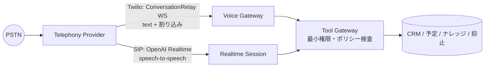

# VOICE — 音声アーキテクチャ

区分：すべて **PROPOSED**。エンドポイントやモデル名は実装する Phase（11・12）で公式ドキュメントを確認してから確定する。

| 論点 | 方針 |
|---|---|
| 方式 | 第1段：現行と同じ Twilio ConversationRelay（Twilio 側で音声認識・音声合成・割り込みを処理。日本語は ja-JP-Neural2-B で実績あり）。第2段：OpenAI Realtime の SIP 接続（speech-to-speech で低遅延。`realtime.call.incoming` → accept / refer / hangup）。モデル名は実装時に公式ドキュメントで確認する |
| VAD / 話者交代 | プロバイダ側のサーバー VAD を使う。こちらは割り込み（interrupt）を受けたら、生成中の応答を破棄する |
| 割り込み（barge-in） | ConversationRelay の `interrupt` メッセージ／Realtime の発話開始イベントを受けたら、送信中のテキストをやめ、会話履歴は「実際に再生された部分まで」に切り詰める |
| 無音 | 8 秒で確認の一言、さらに 8 秒で終話の挨拶をして WRAP_UP へ |
| ツール呼び出し | すべて Tool Gateway を通す（K 参照） |
| 人への引き継ぎ | ConversationRelay：`{"type":"end","handoffData":"…"}` → `<Connect action>` のコールバックで担当者へ。SIP：`/refer` で担当者番号へ転送 |
| 終話 | 状態機械が COMPLETED になったら provider.endCall |
| DTMF | 受信はイベントとして記録し、会話の入力にはしない（番号入力の誘導は将来） |
| 留守電の判定 | 留守電を検知したら（Twilio AMD）伝言を残さず NO_ANSWER / VOICEMAIL にする（無断の録音メッセージを残さない） |
| タイムアウト | 1通話の最長時間（キャンペーン設定、既定 15 分）。AI の応答が 3 秒以上かかったらつなぎの一言を入れ、10 秒で HUMAN_REQUIRED |
| 回線断 | WebSocket が切れたら通話を FAILED にして、未記録の会話を保存する。自動で掛け直さない |

## 状態の対応（依頼文の例との関係）

依頼文の例 `QUEUED / DIALING / RINGING / ANSWERED / AI_ACTIVE / HUMAN_ACTIVE / ENDING / COMPLETED / FAILED / CANCELLED` は、
本設計では次の3つに分けて持つ（ADR-0005）。回線の状態と「いま誰が話しているか」は変わるタイミングも障害の起き方も違うため。

| 依頼文の例 | 本設計での表現 |
|---|---|
| QUEUED | `call_jobs`（キュー）の PENDING。通話はまだ作らない |
| DIALING / RINGING | 通話（Call）の `DIALING` / `RINGING` |
| ANSWERED | 通話の `IN_PROGRESS` |
| AI_ACTIVE / HUMAN_ACTIVE | 会話（Conversation）の `controller = AI / HUMAN` |
| ENDING | 会話の `WRAP_UP` または Safety 状態（終話処理中） |
| COMPLETED / FAILED / CANCELLED | 通話の `ENDED`・`NO_ANSWER`・`BUSY` / `FAILED` / `CANCELED` |

## テスト用の電話シミュレーター（FakeTelephonyProvider、Phase 8）

単純な Mock ではなく、実際のプロバイダで起きることを再現するシミュレーターにする。

| シナリオ | 再現する内容 | 確かめること |
|---|---|---|
| ring → answer | 正常系 | 状態が順に進む |
| busy / reject | 話し中・拒否 | `BUSY` / `FAILED` で終わり、不在の再試行ポリシーに乗る |
| timeout | 応答なし | `NO_ANSWER` |
| disconnect | 通話中の切断 | `FAILED`、会話の記録が保存される |
| voicemail | 留守電 | 伝言を残さず `VOICEMAIL` |
| provider error | API が 5xx を返す | 自動で掛け直さない |
| duplicate webhook | 同じイベントが2回届く | 2回目は記録だけで状態は変わらない |
| delayed webhook | 遅れて届く | 終端状態を後退させない |
| out-of-order webhook | `ENDED` が `RINGING` より先に届く | 最終状態が正しい |
